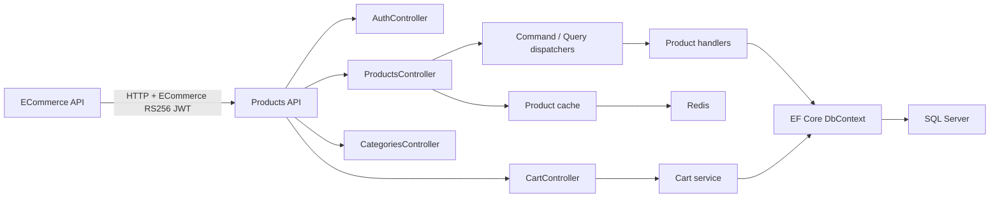

# Products API

A focused ASP.NET Core Web API for product catalog and persistent shopping-cart data, built with **feature-oriented vertical slices, CQRS-style request handling, EF Core persistence, JWT authorization, Redis-backed caching, rate limiting, Dockerized local infrastructure, and CI/CD deployment to Azure App Service**.

The project is intentionally small enough to read end-to-end, but includes enough production-shaped concerns to be useful as a reference API.

---

## What this project is for

| Goal | How it shows up here |
|------|----------------------|
| **Product catalog API** | CRUD endpoints for products, categories, prices, attributes, and related catalog data |
| **Persistent carts** | Authenticated, per-shopper carts with price snapshots, version checks, and current-price totals |
| **CQRS-style handlers** | Commands and queries are dispatched through `ICommandDispatcher` and `IQueryDispatcher` |
| **SQL Server persistence** | Entity Framework Core, SQL Server provider, migrations, and design-time context factory |
| **JWT + RBAC** | HMAC service tokens for catalog management and RSA-validated ECommerce shopper tokens for carts |
| **Caching** | Optional Redis product caching with explicit invalidation on mutations |
| **Operational safety** | Rate limiting, structured error responses, environment-driven configuration |
| **Testing** | xUnit unit tests, HTTP integration tests, and SQL Server Testcontainers handler tests |
| **Deployment** | GitHub Actions build/test/publish/deploy workflow for Azure App Service |

Use this repo as a **reference API** for backend patterns and cloud wiring, not as a complete commerce platform.

---

## Tech stack

### API (`src/ProductsApi`)

| Area | Technologies |
|------|--------------|
| Runtime | .NET 10 |
| Web | ASP.NET Core controllers, Swagger/OpenAPI |
| Data | Entity Framework Core 10, SQL Server |
| Security | Separate HMAC and RSA/RS256 bearer schemes, roles, and scopes |
| Caching | `IDistributedCache` with StackExchange.Redis provider |
| Rate limiting | ASP.NET Core built-in rate limiting middleware |
| DI conventions | Scrutor-based handler registration |

### Tests (`tests/`)

- **xUnit**
- **Moq** for controller orchestration tests
- **Microsoft.AspNetCore.Mvc.Testing** for authentication and cart HTTP integration tests
- **Testcontainers.MsSql** for catalog and cart tests against a real SQL Server instance

### Local infrastructure

- Docker Compose
- SQL Server 2022 container
- Redis 7 container

---

## Solution layout

```text
products-api/
|-- src/
|   `-- ProductsApi/
|       |-- Caching/              # Product cache abstraction and Redis implementation
|       |-- Common/               # Result, CQRS dispatching, shared API response types
|       |-- Controllers/          # Auth, product, and cart HTTP endpoints
|       |-- Data/                 # EF Core DbContext, entities, migrations
|       |-- Features/
|       |   |-- Products/         # Use-case slices: commands, queries, handlers, and shared product code
|       |   `-- Cart/             # Cart operations, mapping, contracts, and per-shopper lock manager
|       `-- Security/             # HMAC/RSA JWT validation, authorization, and rate-limit policies
|-- tests/
|   |-- ProductsApi.UnitTests/
|   `-- ProductsApi.IntegrationTests/
|-- Dockerfile
|-- docker-compose.yml
|-- ProductsApi.sln
`-- .github/workflows/deploy.yml
```



---

## Architecture

The project uses a **hybrid, vertical-slice-oriented architecture** rather than a strict vertical-slice implementation.

Each product use case has its own folder and request/handler pair—for example `CreateProduct`, `GetProductById`, and `PatchProduct`. A change to one product operation is therefore usually contained in one slice. Commands and queries are dispatched through small in-process dispatchers.

Some concerns intentionally remain shared across slices:

- Controllers own HTTP routing and response translation.
- `AppDbContext`, entities, and migrations form the shared persistence layer.
- Product mapping and validation used by several operations live under `Features/Products/Shared`.
- Cart behavior is currently grouped as one cohesive feature service because its operations share concurrency, pricing, and persistence rules.
- Security, caching, and CQRS dispatching are cross-cutting infrastructure.

This preserves the main vertical-slice benefit—organizing business behavior around features and use cases—without duplicating shared infrastructure or forcing every cart operation into an artificial command/handler pair.

## Patterns & practices

- **Feature-oriented use cases**: product operations live in individual folders under `Features/Products`; cart behavior lives under `Features/Cart`.
- **CQRS-style product dispatching**: product controllers call command/query dispatchers instead of directly using EF Core.
- **Category navigation data**: `GET /api/categories` returns categories alphabetically with parent IDs for hierarchy-aware clients.
- **Full-text product search**: `GET /api/products?search=mechanical%20keyboard` searches product names, brands, and descriptions through SQL Server Full-Text Search.
- **Explicit HTTP contracts**: success and error response types are documented with `ProducesResponseType`.
- **Role-based access control**:
  - Product read endpoints require an authenticated JWT.
  - Product write endpoints require `Admin` or `ProductManager`.
  - Cart endpoints accept only ECommerce-issued RS256 tokens with the `CartUser` role and the appropriate `cart:read` or `cart:write` scope.
- **Cart concurrency control**: absolute quantities, cart-wide versions, and a per-shopper SQL application lock prevent duplicate or lost mutations.
- **Cache-aside product caching**:
  - `GET /api/products`
  - `GET /api/products/{id}`
  - writes explicitly invalidate product cache entries.
- **Environment-driven configuration**: production secrets and service endpoints come from environment variables.

---

## Prerequisites

- [.NET 10 SDK](https://dotnet.microsoft.com/download)
- Docker Desktop, if using Docker Compose or Testcontainers locally
- SQL Server LocalDB, SQL Server, or Docker Compose for local database access

---

## Run locally (not really, most of the project requires available azure infrastructure)

### Option 1: Visual Studio / dotnet run

The development settings use LocalDB:

```text
Server=(localdb)\mssqllocaldb;Database=ProductsApiDb;Trusted_Connection=True;MultipleActiveResultSets=true;TrustServerCertificate=True
```

Configure the ECommerce public-key validator through environment variables or your local secret provider first:

```powershell
$env:ECommerceJwt__Issuer = "ecommerce-api"
$env:ECommerceJwt__Audience = "products-api"
$env:ECommerceJwt__KeyId = "<matching ECommerce key ID>"
$env:ECommerceJwt__PublicKey = "<base64 SubjectPublicKeyInfo public key>"
```

Then start the API from the repository root:

```bash
dotnet run --project src/ProductsApi/ProductsApi.csproj
```

Development settings currently enable startup migrations:

```json
"Database": {
  "MigrateOnStartup": true
}
```

Swagger is available in Development:

```text
https://localhost:<port>/swagger
```

### Option 2: Docker Compose

Use this for a complete local stack. The `products-api` service must receive the four required `ECommerceJwt__*` values through a local Compose override or equivalent environment mapping before startup; keep the RSA private key in ECommerce only.

```bash
docker compose up --build
```

This starts:

```text
products-api
sqlserver
redis
```

The API is exposed at:

```text
http://localhost:8080
```

Docker Compose sets `Database__MigrateOnStartup=true`, so the SQL Server container database is created/updated automatically.

---

## Authentication

The API uses two independent bearer-token schemes.

### Product service tokens

Issue a JWT:

```http
POST http://localhost:8080/api/auth/token
Content-Type: application/json
X-API-Key: fake-local-docker-api-key

{
  "subject": "local-client",
  "roles": ["ProductManager"]
}
```

Use the returned token:

```http
GET http://localhost:8080/api/products
Authorization: Bearer <accessToken>
```

Product endpoint authorization:

| Endpoint type | Requirement |
|---------------|-------------|
| `GET /api/products` | Valid JWT |
| `GET /api/products/{id}` | Valid JWT |
| `GET /api/categories` | Valid JWT |
| `POST /api/products` | `Admin` or `ProductManager` role |
| `PUT /api/products/{id}` | `Admin` or `ProductManager` role |
| `PATCH /api/products/{id}` | `Admin` or `ProductManager` role |
| `DELETE /api/products/{id}` | `Admin` or `ProductManager` role |

### ECommerce shopper tokens

ECommerce authenticates the shopper, signs a short-lived JWT with its RSA private key, and forwards it to Products API. Products API holds only the matching public key and validates:

- algorithm: `RS256`
- issuer and audience
- exact `kid`
- token lifetime
- shopper ID in `sub`
- `CartUser` role
- `cart:read` or `cart:write` scope

The private key must remain in ECommerce. Products API's `/api/auth/token` endpoint cannot issue cart tokens.

Cart endpoints:

| Endpoint | Required scope | Behavior |
|----------|----------------|----------|
| `GET /api/cart` | `cart:read` | Returns the current shopper's cart |
| `PUT /api/cart/items/{productId}` | `cart:write` | Sets an absolute item quantity |
| `DELETE /api/cart/items/{productId}` | `cart:write` | Removes one item |
| `DELETE /api/cart` | `cart:write` | Clears the cart |

Mutation requests include the cart version returned by the latest successful read or mutation. Stale versions return `409 Conflict`. Products API calculates current totals and preserves the original price/currency snapshot for change warnings. See [docs/cart-backend.md](docs/cart-backend.md) for the complete contract.

---

## Tests

Run the normal local test suite:

```bash
dotnet test ProductsApi.sln
```

Without the opt-in variable, this runs:

- controller unit tests
- auth endpoint integration tests
- database-independent integration tests; SQL-backed test bodies remain disabled

To run the complete integration suite, start Docker and set:

```powershell
$env:RUN_TESTCONTAINERS="true"
dotnet test ProductsApi.sln
```

`CartTests` and `ProductHandlersTests` share one disposable SQL Server container through `MsSqlContainerFixture`. The fixture applies EF migrations once and resets the database between tests. No test uses the application or Azure SQL connection string.

In CI, the GitHub Actions workflow runs on `ubuntu-latest` and sets:

```text
RUN_TESTCONTAINERS=true
```

so Testcontainers starts SQL Server through the runner's Docker daemon. A failed test or container startup prevents the deployment job from running.

---

## Configuration

### Required production variables

Set these in Azure App Service environment variables:

```text
ASPNETCORE_ENVIRONMENT=Production
ConnectionStrings__DefaultConnection=<Azure SQL connection string>
Jwt__Audience=<JWT audience>
Jwt__ExpireMinutes=<token lifetime in minutes>
Jwt__Issuer=<JWT issuer>
Jwt__Key=<strong JWT signing key>
Jwt__ApiKey=<private API key used to request tokens>
ECommerceJwt__Issuer=ecommerce-api
ECommerceJwt__Audience=products-api
ECommerceJwt__PublicKey=<base64 SubjectPublicKeyInfo RSA public key>
ECommerceJwt__KeyId=<key ID used by ECommerce in the JWT kid header>
```

### Optional production variables

Redis:

```text
Redis__Enabled=true
Redis__ConnectionString=<host>:<port>,password=<password>,ssl=True,abortConnect=False
Redis__InstanceName=products-api:
Redis__RegisterNullCacheWhenDisabled=false
```

Database migration on startup:

```text
Database__MigrateOnStartup=false
```

Leave startup migrations disabled in production unless you deliberately want the API process to apply migrations.

---

## CI/CD

The workflow in `.github/workflows/deploy.yml`:

1. Restores dependencies.
2. Builds the solution.
3. Runs tests, including Testcontainers in CI.
4. Publishes the API.
5. Packages the app artifact.
6. Generates an idempotent EF Core migration SQL script.
7. Uploads app and migration artifacts.
8. Authenticates to Azure with OIDC.
9. Deploys to Azure App Service.

GitHub secrets expected:

```text
AZURE_CLIENT_ID
AZURE_TENANT_ID
AZURE_SUBSCRIPTION_ID
```

GitHub variable expected:

```text
AZURE_WEBAPP_NAME
```

---

## Docker notes

Build only the API image:

```bash
docker build -t products-api:local .
```

Run the complete local stack:

```bash
docker compose up --build
```

The Dockerfile builds only the API. Docker Compose is responsible for running SQL Server and Redis beside it.

---

## License

See [LICENSE](LICENSE).

---

*This README describes the repository's intent: a compact Products API that demonstrates backend architecture, operational wiring, and cloud deployment practices.*
