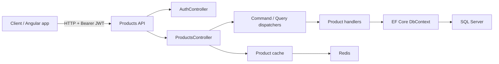

# Products API

A focused ASP.NET Core Web API for product catalog data, built to demonstrate **CQRS-style request handling, EF Core persistence, JWT authorization, Redis-backed caching, rate limiting, Dockerized local infrastructure, and CI/CD deployment to Azure App Service**.

The project is intentionally small enough to read end-to-end, but includes enough production-shaped concerns to be useful as a reference API.

---

## What this project is for

| Goal | How it shows up here |
|------|----------------------|
| **Product catalog API** | CRUD endpoints for products, categories, prices, attributes, and related catalog data |
| **CQRS-style handlers** | Commands and queries are dispatched through `ICommandDispatcher` and `IQueryDispatcher` |
| **SQL Server persistence** | Entity Framework Core, SQL Server provider, migrations, and design-time context factory |
| **JWT + RBAC** | Bearer token validation, API-key-protected token issuing, read/write product policies |
| **Caching** | Optional Redis product caching with explicit invalidation on mutations |
| **Operational safety** | Rate limiting, structured error responses, environment-driven configuration |
| **Testing** | xUnit unit tests, HTTP integration tests, and SQL Server Testcontainers handler tests |
| **Deployment** | GitHub Actions build/test/publish/deploy workflow for Azure App Service |

Use this repo as a **reference API** for backend patterns and cloud wiring, not as a complete commerce platform.

---

## Tech stack

### API (`src/ProductsApi`)

| Area | Technologies |
|------|--------------|
| Runtime | .NET 10 |
| Web | ASP.NET Core controllers, Swagger/OpenAPI |
| Data | Entity Framework Core 10, SQL Server |
| Security | JWT Bearer authentication, role-based authorization |
| Caching | `IDistributedCache` with StackExchange.Redis provider |
| Rate limiting | ASP.NET Core built-in rate limiting middleware |
| DI conventions | Scrutor-based handler registration |

### Tests (`tests/`)

- **xUnit**
- **Moq** for controller orchestration tests
- **Microsoft.AspNetCore.Mvc.Testing** for auth endpoint integration tests
- **Testcontainers.MsSql** for SQL Server-backed handler integration tests

### Local infrastructure

- Docker Compose
- SQL Server 2022 container
- Redis 7 container

---

## Solution layout

```text
products-api/
|-- src/
|   `-- ProductsApi/
|       |-- Caching/              # Product cache abstraction and Redis implementation
|       |-- Common/               # Result, CQRS dispatching, shared API response types
|       |-- Controllers/          # Auth and product HTTP endpoints
|       |-- Data/                 # EF Core DbContext, entities, migrations
|       |-- Features/Products/    # Product commands, queries, handlers, DTOs
|       `-- Security/             # JWT, authorization, and rate-limit policy constants
|-- tests/
|   |-- ProductsApi.UnitTests/
|   `-- ProductsApi.IntegrationTests/
|-- Dockerfile
|-- docker-compose.yml
|-- ProductsApi.sln
`-- .github/workflows/deploy.yml
```



---

## Patterns & practices

- **Feature-oriented product code**: product use cases live under `Features/Products`.
- **CQRS-style dispatching**: controllers call command/query dispatchers instead of directly using EF Core.
- **Explicit HTTP contracts**: success and error response types are documented with `ProducesResponseType`.
- **Role-based access control**:
  - Product read endpoints require an authenticated JWT.
  - Product write endpoints require `Admin` or `ProductManager`.
- **Cache-aside product caching**:
  - `GET /api/products`
  - `GET /api/products/{id}`
  - writes explicitly invalidate product cache entries.
- **Environment-driven configuration**: production secrets and service endpoints come from environment variables.

---

## Prerequisites

- [.NET 10 SDK](https://dotnet.microsoft.com/download)
- Docker Desktop, if using Docker Compose or Testcontainers locally
- SQL Server LocalDB, SQL Server, or Docker Compose for local database access

---

## Run locally

### Option 1: Visual Studio / dotnet run

The development settings use LocalDB:

```text
Server=(localdb)\mssqllocaldb;Database=ProductsApiDb;Trusted_Connection=True;MultipleActiveResultSets=true;TrustServerCertificate=True
```

Run from the repository root:

```bash
dotnet run --project src/ProductsApi/ProductsApi.csproj
```

Development settings currently enable startup migrations:

```json
"Database": {
  "MigrateOnStartup": true
}
```

Swagger is available in Development:

```text
https://localhost:<port>/swagger
```

### Option 2: Docker Compose

Use this for a complete local stack:

```bash
docker compose up --build
```

This starts:

```text
products-api
sqlserver
redis
```

The API is exposed at:

```text
http://localhost:8080
```

Docker Compose sets `Database__MigrateOnStartup=true`, so the SQL Server container database is created/updated automatically.

---

## Auth flow

Issue a JWT:

```http
POST http://localhost:8080/api/auth/token
Content-Type: application/json
X-API-Key: fake-local-docker-api-key

{
  "subject": "local-client",
  "roles": ["ProductManager"]
}
```

Use the returned token:

```http
GET http://localhost:8080/api/products
Authorization: Bearer <accessToken>
```

Product endpoint authorization:

| Endpoint type | Requirement |
|---------------|-------------|
| `GET /api/products` | Valid JWT |
| `GET /api/products/{id}` | Valid JWT |
| `POST /api/products` | `Admin` or `ProductManager` role |
| `PUT /api/products/{id}` | `Admin` or `ProductManager` role |
| `PATCH /api/products/{id}` | `Admin` or `ProductManager` role |
| `DELETE /api/products/{id}` | `Admin` or `ProductManager` role |

---

## Tests

Run the normal local test suite:

```bash
dotnet test ProductsApi.sln
```

This runs:

- controller unit tests
- auth endpoint integration tests
- Testcontainers tests in opt-in mode only

To run SQL Server Testcontainers locally, start Docker and set:

```powershell
$env:RUN_TESTCONTAINERS="true"
dotnet test ProductsApi.sln
```

In CI, the GitHub Actions workflow sets:

```text
RUN_TESTCONTAINERS=true
```

so SQL Server-backed integration tests run before deployment.

---

## Configuration

### Required production variables

Set these in Azure App Service environment variables:

```text
ASPNETCORE_ENVIRONMENT=Production
ConnectionStrings__DefaultConnection=<Azure SQL connection string>
Jwt__Audience=<JWT audience>
Jwt__ExpireMinutes=<token lifetime in minutes>
Jwt__Issuer=<JWT issuer>
Jwt__Key=<strong JWT signing key>
Jwt__ApiKey=<private API key used to request tokens>
```

### Optional production variables

Redis:

```text
Redis__Enabled=true
Redis__ConnectionString=<host>:<port>,password=<password>,ssl=True,abortConnect=False
Redis__InstanceName=products-api:
Redis__RegisterNullCacheWhenDisabled=false
```

Database migration on startup:

```text
Database__MigrateOnStartup=false
```

Leave startup migrations disabled in production unless you deliberately want the API process to apply migrations.

---

## CI/CD

The workflow in `.github/workflows/deploy.yml`:

1. Restores dependencies.
2. Builds the solution.
3. Runs tests, including Testcontainers in CI.
4. Publishes the API.
5. Packages the app artifact.
6. Generates an idempotent EF Core migration SQL script.
7. Uploads app and migration artifacts.
8. Authenticates to Azure with OIDC.
9. Deploys to Azure App Service.

GitHub secrets expected:

```text
AZURE_CLIENT_ID
AZURE_TENANT_ID
AZURE_SUBSCRIPTION_ID
```

GitHub variable expected:

```text
AZURE_WEBAPP_NAME
```

---

## Docker notes

Build only the API image:

```bash
docker build -t products-api:local .
```

Run the complete local stack:

```bash
docker compose up --build
```

The Dockerfile builds only the API. Docker Compose is responsible for running SQL Server and Redis beside it.

---

## License

See [LICENSE](LICENSE).

---

*This README describes the repository's intent: a compact Products API that demonstrates backend architecture, operational wiring, and cloud deployment practices.*
